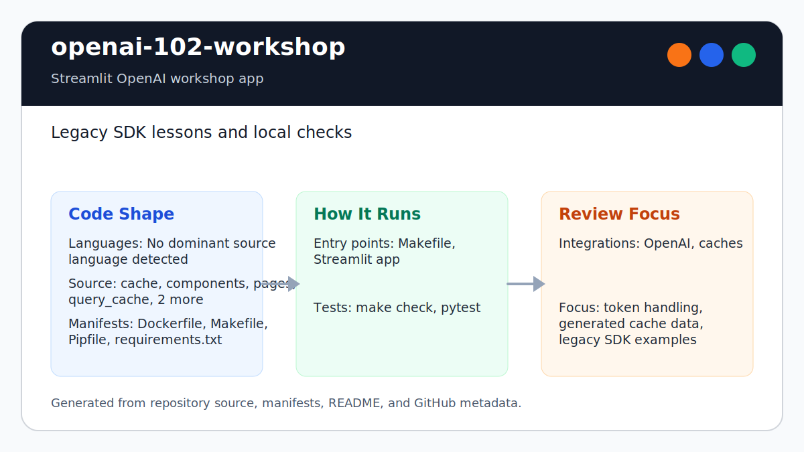

# openai-102-workshop

<!-- README-OVERVIEW-IMAGE -->


## Overview

`garethpaul/openai-102-workshop` is a Streamlit learning app for OpenAI API
concepts, embeddings, retrieval-style search, recommendations, clustering, and
fine-tuning exercises.

This README is based on the checked-in source, manifests, scripts, and repository metadata on the `main` branch. The project language mix found during review was: no dominant source language detected.

## Repository Contents

- `README.md` - project overview and local usage notes
- `requirements.in` / `requirements.txt` - reviewed direct application
  dependencies and the generated exact lock
- `requirements-test.in` / `requirements-test.txt` - reviewed verification
  tools and the generated exact test lock
- `cache` - source or example code
- `CHANGES.md` - baseline change log
- `components` - source or example code
- `Dockerfile` - container build instructions
- `Makefile` - local build or utility targets
- `pages` - source or example code
- `Pipfile` - Python dependency or packaging metadata
- `query_cache` - source or example code
- `scripts/check-workshop-baseline.py` - static baseline checks used by `make check`
- `SECURITY.md` - security reporting and disclosure guidance
- `test_app.py` - no-network tests for cache and retrieval helpers
- `test_embedding_cache.py` - no-network tests for the clustering JSON cache
- `url_cache` - source or example code
- `utils` - source or example code
- `docs/plans/2026-06-08-openai-102-workshop-baseline.md` - completed hardening plan

Additional scan context:

- Source directories: cache, components, pages, query_cache, url_cache, utils
- Dependency and build manifests: Dockerfile, Makefile, Pipfile,
  requirements.in, requirements.txt, requirements-test.in,
  requirements-test.txt
- Entry points or build surfaces: Dockerfile, Makefile
- Test-looking files: `test_app.py`

## Getting Started

### Prerequisites

- Git
- Python 3.12 for the workshop runtime and verification environments
- `uv` 0.11.19 when regenerating the exact requirement locks
- An OpenAI API key supplied through local UI input or `OPENAI_API_KEY` when running API lessons

### Setup

```bash
git clone https://github.com/garethpaul/openai-102-workshop.git
cd openai-102-workshop
python -m pip install --require-hashes -r requirements.txt
make lint
make test
make build
make check
```

The setup commands above are derived from repository files. Legacy mobile, Python, or JavaScript samples may require older SDKs or package versions than a modern workstation uses by default.

## Running or Using the Project

- The OpenAI lessons preserve historical `openai==0.28.1` calls and model
  identifiers. Read [`docs/openai-api-compatibility.md`](docs/openai-api-compatibility.md)
  before using an example as the basis for a new integration.
- Run `make lint`, `make test`, `make build`, and `make check` before changing
  workshop logic or generated-cache behavior.
- `make test` runs pytest with Python bytecode writes disabled so verification
  does not leave `__pycache__` files behind.
- `make lock-check` regenerates both Python 3.12 locks from their committed
  preferences and rejects drift; `make lock-upgrade` deliberately selects new
  compatible versions for a reviewed dependency update.
- Both universal locks include public-PyPI artifact hashes. Exact-lock installs
  automatically activate pip's hash-checking mode; local and container commands
  also use `--require-hashes` explicitly so unexpected distributions fail closed.
- `make audit` checks every exact pin in both complete locks without rebuilding
  their universal dependency graphs. Hosted application validation separately
  installs the full application lock and runs `pip check`.
- Both generated locks retain the reviewed `aiohttp==3.14.1` and
  `langsmith==0.8.18` security floors; the application lock also retains
  `starlette==1.3.1`, and the verification lock retains `msgpack==1.2.1`.
  Dependency updates must keep the application and verification graphs aligned.
- `make runtime-check` imports every reviewed direct application dependency.
- `make smoke` launches a bounded headless Streamlit process and requires a
  healthy localhost endpoint without an API credential.
- Run `make run` or `streamlit run 👋_Hello.py` to start the app.
- Text-search crawling accepts only HTTP(S) URLs whose complete DNS answer set
  is globally routable under a version-independent IANA special-address
  policy. Each outbound socket is pinned directly to a validated numeric
  address while HTTPS retains the original SNI and certificate hostname.
  Redirects, URL count, DNS/connect/read/total time, wire bytes, decoded bytes,
  decompression, and aggregate crawl work are bounded; proxy and `.netrc`
  environment state is not consulted.
- Enter an OpenAI API key only through the local sidebar or `OPENAI_API_KEY`.
- Treat the checked-in snippets as legacy OpenAI SDK examples pinned to
  `openai==0.28.1`. Model or SDK migrations should be deliberate compatibility
  updates.
- The fine-tuning retry example retries only the pinned SDK's rate-limit error;
  other failures surface immediately and the final rate-limit attempt re-raises.
- The Starlette resolver floor is explicit in `requirements.in` so lock
  regeneration and audits from the Makefile's public-PyPI contract cannot roll
  the reviewed 1.3.1 security pin back to 1.2.1 or miss the reviewed release.
- Retrieval vector math helpers validate dimensionality and zero-vector cosine
  inputs before returning workshop results.
- Shared vector value validation rejects empty, boolean, string, complex,
  non-finite, and overflowing inputs across cosine, Euclidean, and Manhattan
  helpers.
- Small embedding fixtures cap nearest-neighbor lookup to the available row
  count so no-network tests can query them.
- Empty embedding fixtures fail with a clear validation error before model
  training.
- Malformed embedding fixtures fail before model training when rows are missing
  metadata or embedding dimensions do not match.
- Embedding fixture metadata must include non-empty `text` before retrieval
  examples build augmented queries.
- Finite embedding values are required before nearest-neighbor training so
  invalid fixture vectors fail with clear errors.
- Numeric embedding values must be real numeric types, not stringified numbers,
  before model training.
- Safe JSON embedding fixtures replace executable pickle data across the shared
  loader, step-4 demo, container build, and tracked test fixture. The demo uses
  an explicit local `EMBEDDINGS_FILE_PATH` and never downloads fixture data.
  Each fixture is a JSON array of `[id, embedding, {"text": "..."}]` rows;
  missing or invalid data fails before the demo makes an API request.
- Query embedding validation rejects empty, boolean, non-numeric, non-finite,
  and dimension-mismatched vectors before nearest-neighbor lookup.
- Recommendations compare the selected customer's industry embedding against
  every available industry and choose the nearest product-backed industry with
  a configured list containing at least one nonempty string product name.
  Malformed customer-list members are ignored so later valid records remain
  eligible for recommendation, and each match must provide a nonempty string customer industry
  before embedding lookup.
- Recommendation container validation rejects malformed top-level customer,
  embedding, and product collections before iteration or mapping lookup.
- Invalid recommendation embedding pairs are skipped without discarding valid
  similarity scores or crashing the recommendation page.
- The customer-industry recommendation tie break prefers the customer's own
  product-backed industry when equal similarity scores would otherwise depend
  on mapping insertion order.

## Testing and Verification

- `make lint`
- `make test`
- `make build`
- `make check`
- The Make gates are location-independent. From another directory, pass the
  checkout's Makefile by absolute path, such as
  `make -f /path/to/openai-102-workshop/Makefile check`.
- `make lock-check`
- `make audit`
- `make runtime-check`
- `make smoke`
- `python3 -m pytest -q test_app.py`
- `python3 scripts/check-workshop-baseline.py`
- Pinned hosted Linux validation uses Python 3.12. One job installs the exact
  test lock, runs `pip check`, `make check`, lock regeneration, and both
  vulnerability audits. A separate job installs the application lock, checks
  direct imports, and launches the real headless Streamlit health smoke.
- GitHub Actions runs both jobs for pushes and pull requests without OpenAI
  credentials or paid API calls.

When the required SDK or runtime is unavailable, use static checks and source review first, then verify on a machine that has the matching platform toolchain.

## Configuration and Secrets

- Detected references to OpenAI. Keep API keys, OAuth credentials, tokens, and account-specific values in local configuration only.
- Generated caches live under `cache/`, `url_cache/`, `query_cache/`, and files
  such as `embedding_cache.json`. Do not add private cache refreshes or customer
  data.
- The clustering lesson uses a strict UTF-8 JSON embedding cache with string
  keys and values. `embedding_cache.json` is ignored and should remain
  untracked; malformed or structurally invalid local cache data is rejected.
  Cache reads require one owned regular-file link and validate the opened
  descriptor, while writes use an exclusive no-follow temporary file before
  atomic replacement.
- New text embedding cache writes use hashed filenames so user input cannot escape the cache directory.
- Python bytecode generated by local tooling should stay out of the repository
  and out of completed verification workspaces.

## Security and Privacy Notes

- Review changes touching external API calls or credential-adjacent configuration; examples from the scan include Pipfile.
- Review changes touching network requests, sockets, or service endpoints; examples from the scan include Dockerfile, Pipfile.
- Review changes touching file, media, JSON, XML, CSV, OCR, or data parsing; examples from the scan include Dockerfile.
- Safe JSON embedding fixtures must remain the only nearest-neighbor lesson
  input format; do not restore pickle loading or hidden remote downloads.
- Review vector math helper changes with no-network tests so retrieval lessons
  fail clearly on invalid fixture data.
- Review small embedding fixtures with no-network nearest-neighbor tests before
  refreshing workshop data.
- Empty embedding fixtures should fail closed instead of producing ambiguous
  unpacking errors.
- Malformed embedding fixtures should fail closed before nearest-neighbor
  training.
- Metadata text validation should fail closed before retrieval examples assume
  `metadata["text"]` exists.
- Finite embedding values should be checked before retrieval examples train
  nearest-neighbor models.
- Numeric embedding values should be enforced before retrieval examples accept
  fixture vectors.
- Python bytecode should not remain after local `make test` or `make check`
  runs.

## Maintenance Notes

- Use an absolute Makefile path when running workshop tooling outside the
  checkout. Paths containing spaces or apostrophes remain supported, caller
  `ROOT` values are ignored, and `MAKEFILE_LIST` overrides fail closed before
  workshop verification runs.
- See `SECURITY.md` for vulnerability reporting and safe research guidance.
- See `CHANGES.md` and `docs/plans/2026-06-08-openai-102-workshop-baseline.md` for the current verification baseline.
- See `docs/plans/2026-06-09-make-gate-aliases.md` for the local verification
  gate aliases.
- See `docs/plans/2026-06-10-numeric-embedding-values.md` for the embedding
  fixture numeric-type validation contract.
- See `docs/plans/2026-06-12-vector-value-validation.md` for the shared vector
  math input boundary.
- See `docs/plans/2026-06-10-query-embedding-validation.md` for the retrieval
  query vector validation contract.
- See `docs/plans/2026-06-10-hosted-workshop-validation.md` for the hosted
  Linux test dependency and `make check` contract.
- See `docs/plans/2026-06-12-supported-python-dependency-graph.md` for the
  Python 3.12 application lock, audit, import, and Streamlit smoke contract.
- See `docs/plans/2026-06-10-ci-baseline.md` for the original GitHub Actions
  baseline scope.
- See `VISION.md` for project direction and contribution guardrails.

## Contributing

Keep changes small and tied to the project that is already present in this repository. For code changes, document the toolchain used, avoid committing generated dependency directories or local configuration, and update this README when setup or verification steps change.
